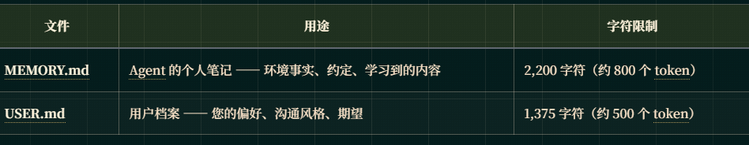
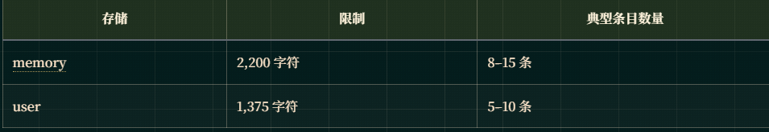

# 持久记忆
Hermes Agent拥有有界且经过筛选的持久记忆，可在不同会话间保持记忆。这使得它能够记住您的偏好、项目、环境以及所学知识。

## 工作原理
Agent由两个文件组成

这两个文件均存储在 ~/.hermes/memories/ 目录下，并在会话开始时作为冻结快照注入系统提示中。Agent通过 memory 工具自行管理其记忆 —— 可添加、替换或删除条目

## 冻结快照模式： 
系统提示注入仅在会话开始时捕获一次，会话期间不会更改。这是有意为之的设计 —— 以保留 LLM 的前缀缓存以提升性能。当 Agent在会话期间添加或删除记忆条目时，更改会立即持久化到磁盘，但不会在当前会话的系统提示中体现，直到下一次会话开始。工具响应始终显示实时状态。

## 两个目标详解

### memory —— Agent的个人笔记
用于记录 Agent需要记住的环境、工作流和经验教训信息：

- 环境事实（操作系统、工具、项目结构）
- 项目约定和配置
- 发现的工具缺陷及绕行方案
- 已完成任务的日记条目
- 有效的技能与技术
- 
### user —— 用户档案
用于记录关于用户身份、偏好和沟通风格的信息：

- 姓名、角色、时区
- 沟通偏好（简洁 vs 详细、格式偏好）
- 烦恼点及应避免事项
- 工作习惯
- 技术熟练程度

## 应保存 vs 忽略的内容

## 容量管理

记忆具有严格的字符限制，以确保系统提示的大小可控：

### 记忆满时会发生什么
工具会返回错误，
此时 Agent应执行以下步骤：

- 读取当前条目（错误响应中已显示）
- 识别可删除或合并的条目
- 使用 replace 将相关条目合并为更短版本
- 然后执行 add 添加新条目
  
最佳实践： 当记忆使用率超过 80%（可在系统提示栏头部查看）时，请在添加新条目前先合并已有条目。例如，将三个独立的“项目使用 X”条目合并为一条综合的项目描述条目。

