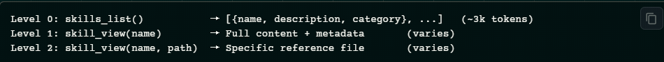

# 技能系统

技能是按需加载的知识文档，Agent在需要时可将其载入。它们遵循 渐进披露 模式，以最小化 token使用量，并与 agentskills.io 开放标准兼容

## 渐进披露
技能采用高效的 token加载模式：


## skill 格式
```
---
name: my-skill
description: Brief description of what this skill does
version: 1.0.0
platforms: [macos, linux]     # 可选 — 仅限于特定操作系统平台
metadata:
  hermes:
    tags: [python, automation]
    category: devops
    fallback_for_toolsets: [web]    # 可选 - 有条件激活（见下文）
    requires_toolsets: [terminal]   # 可选 - 有条件激活（见下文）
    config:                          # 可选 — config.yaml 设置
      - key: my.setting
        description: "What this controls"
        default: "value"
        prompt: "Prompt for setup"
---

# Skill 标题

## 何时使用
Trigger conditions for this skill.

## 操作步骤
1. Step one
2. Step two

## 常见陷阱
- Known failure modes and fixes

## 验证方式
How to confirm it worked.

```

## Agent管理的技能（skill_manage 工具）

Agent可通过 skill_manage 工具自行创建、更新和删除技能。这是 Agent的程序性记忆——当它发现一个非平凡的工作流时，会将其方法保存为技能以供未来复用。

### Agent创建技能的时机
- 成功完成一个复杂任务（5+ 工具调用）后
- 在遭遇错误或死胡同后找到可行路径时
- 用户纠正其方法时
- 发现非平凡工作流时


