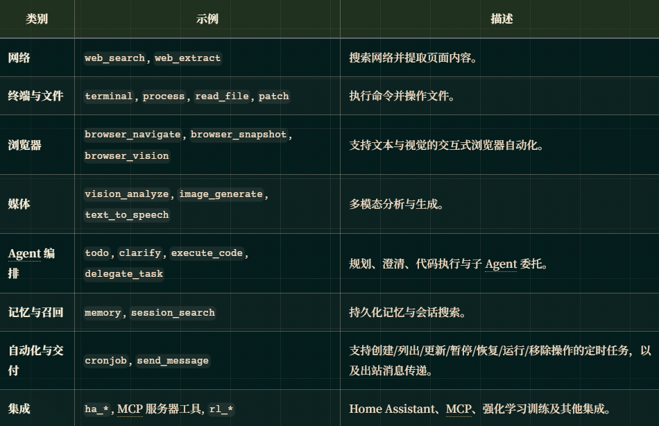
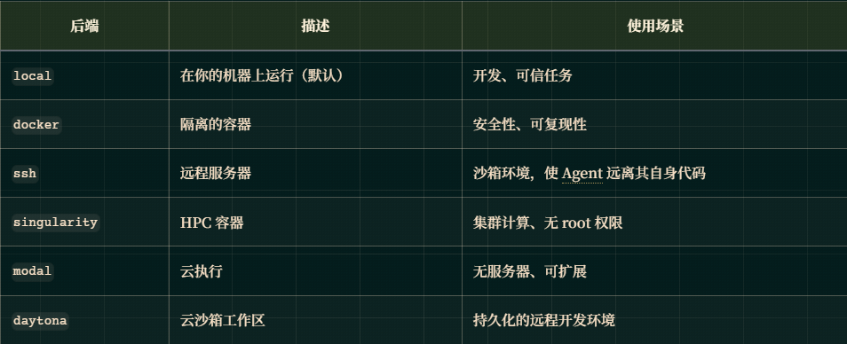

# 工具与工具集
工具是扩展 Agent能力的功能。它们被组织成逻辑上的 工具集，可根据平台启用或禁用。

## 可用工具

### 内置工具
快速统计： 10 个浏览器工具，4 个文件工具，10 个 RL 工具，4 个 Home Assistant 工具，2 个终端工具，2 个网络工具，以及其他工具集中共 15 个独立工具。

### 工具集参考
工具集是命名的工具捆绑包，用于控制 Agent可执行的操作。它们是按平台、按会话或按任务配置工具可用性的主要机制。

#### 工具集工作原理
每个工具都属于且仅属于一个工具集。当你启用某个工具集时，该捆绑包中的所有工具都会对 Agent可用。工具集分为三种类型：

- 核心工具集（Core） —— 一组逻辑上相关的工具（例如，file 工具集包含 read_file、write_file、patch、search_files）
- 复合工具集（Composite） —— 为常见场景组合多个核心工具集（例如，debugging 工具集包含 file、terminal 和 web 工具）
- 平台工具集（Platform） —— 针对特定部署环境的完整工具配置（例如，hermes-cli 是交互式 CLI会话的默认配置）

### MCP工具参考

## 终端工具

